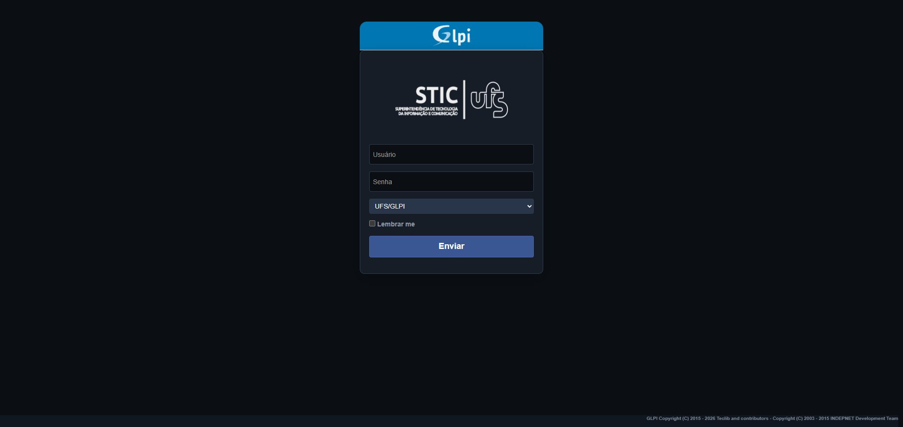
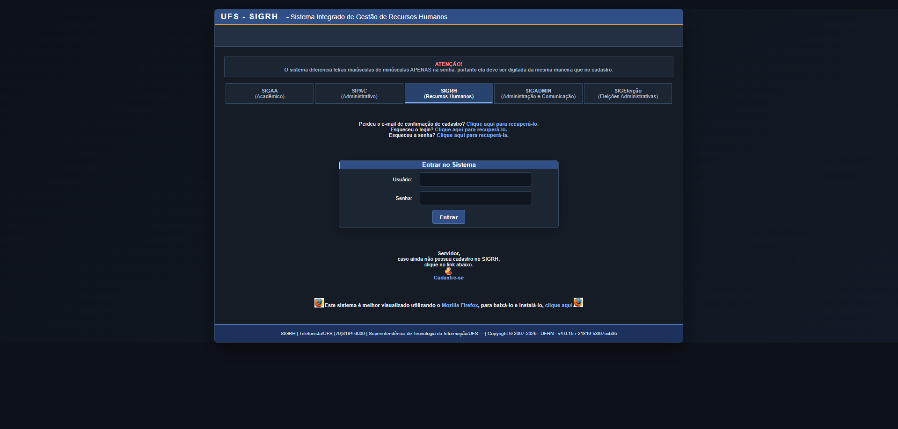
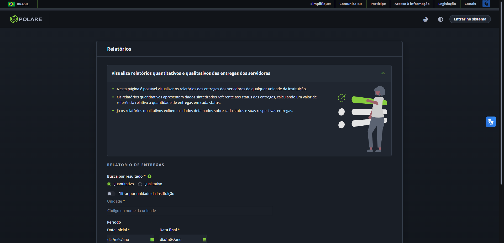

# UFS Dark Theme

Extensão para Google Chrome que aplica um tema escuro aos sistemas institucionais da Universidade Federal de Sergipe (UFS), preservando a identidade visual e melhorando a legibilidade.

## Sistemas compatíveis

- GLPI
- Polare
- SSO
- SEI
- SIGs: SIGAA, SIPAC, SIGRH, SIGADMIN, SIGEleição, RESUNWEB e Caixa Postal

## Instalação local

1. Baixe ou clone este repositório.
2. Abra `chrome://extensions/` no Google Chrome.
3. Ative o **Modo do desenvolvedor**.
4. Clique em **Carregar sem compactação**.
5. Selecione a pasta do projeto.

O tema de cada sistema pode ser ativado ou desativado pelo painel da extensão.
Na impressão, o tema é suspenso automaticamente para preservar o formato e as
cores originais dos documentos; ao fechar a impressão, o modo escuro retorna.

## Como o tema funciona

A extensão usa um motor dinâmico local para analisar e transformar as cores das páginas em tempo real. Os arquivos em `styles/` são aplicados como uma camada final de correções, preservando a identidade visual da UFS e os ajustes específicos de cada sistema.

Se o motor dinâmico não puder ser iniciado, a extensão utiliza automaticamente o CSS específico do sistema como modo de compatibilidade.

## Capturas de tela

### GLPI

### SIGs — exemplo no SIGRH

### Polare — área pública

## Privacidade

A extensão apenas modifica a apresentação visual das páginas compatíveis. Ela não coleta nem transmite dados pessoais ou de navegação. As preferências de ativação são armazenadas por meio do `chrome.storage.sync`.

Consulte a [política de privacidade](docs/PRIVACY-POLICY.md) para mais detalhes.

## Estrutura

- `manifest.json`: configuração Manifest V3.
- `background.js`: busca restrita de recursos visuais nos sistemas suportados.
- `content.js`: integração do motor dinâmico e carregamento das correções.
- `popup.html` e `popup.js`: painel da extensão.
- `styles/`: temas específicos de cada sistema.
- `vendor/`: componentes internos do motor visual e licenças obrigatórias.
- `icons/`: ícones da extensão.
